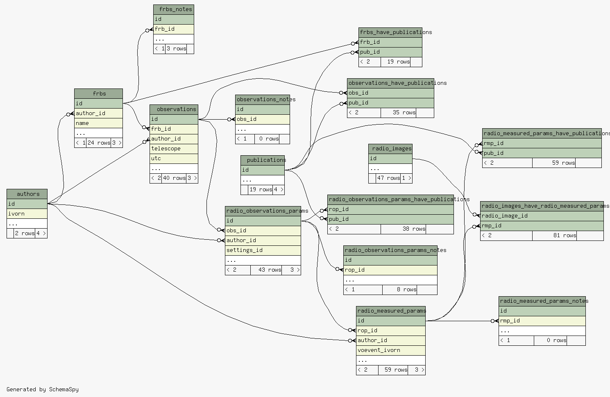

# frbcatdb
[](https://opensource.org/licenses/Apache-2.0)
[](https://travis-ci.org/AA-ALERT/frbcatdb)[](https://codecov.io/gh/AA-ALERT/frbcatdb)[](https://www.codacy.com/app/omrubi/frbcatdb?utm_source=github.com&amp;utm_medium=referral&amp;utm_content=AA-ALERT/frbcatdb&amp;utm_campaign=Badge_Grade)[](http://frbcatdb.readthedocs.io/en/latest/?badge=latest)[](https://badge.fury.io/py/pyfrbcatdb)[](https://doi.org/10.5281/zenodo.1051040)

The frbcatdb is a database to store a catalog of Fast Radio Bursts (FRBs).
The DB is intended to contain old FRB events as well as new FRBs detected by the
AA-ALERT FRB detection pipeline from Apertif observations and also possible follow-up observations or others FRBs detected by other telescopes.
The frbcatdb is attached to the VOEvent backbone and uses this infrastructure as its source.

The `db` folder contains scripts to create an empty frbcat DB (`create_db.csh`),
to import it from an existing dump file (`import_db.sh`) and
to dump an existing DB to a dump file (`dump_db.csh`).
It also contains the model (Entity-Relationship diagram) to be opened with mysql-workbench. 

The `pyfrbcatdb` is Python package for manipulating the frbcatdb and its linking
with the VOEvent backbone.

# pyfrbcatdb usage
A default configuration file is installed in /etc/pyfrbcatdb/dbase.config. In this file the FRBCat database configuration can be defined. Alternatively, a user may supply their own configuration file with a command line argument of the executable, or define the database configuration via argument switches, or, alternatively via environment variables.

For inserting a VOEvent XML file into the FRBCat database, the decode_VOEvent executable is used:
```
usage: decode_VOEvent [-h] [-c MY_CONFIG] --dbName DBNAME [--dbHost DBHOST]
                      [--dbPort DBPORT] --dbUser DBUSER
                      [--dbPassword DBPASSWORD] [--log LOG]
                      VOEvent [VOEvent ...]

Process VOEvent XML file and add it to FRB database Args that start with '--'
(eg. --dbName) can also be set in a config file
(/etc/pyfrbcatdb/dbase.config or specified via -c). Config
file syntax allows: key=value, flag=true, stuff=[a,b,c] (for details, see
syntax at https://goo.gl/R74nmi). If an arg is specified in more than one
place, then commandline values override environment variables which override
config file values which override defaults.

positional arguments:
  VOEvent               List of VOEvent XML files

optional arguments:
  -h, --help            show this help message and exit
  -c MY_CONFIG, --my-config MY_CONFIG
                        config file path
  --dbName DBNAME       name postgres database [env var: dbNameFRBCat]
  --dbHost DBHOST       name postgres database [env var: dbHostFRBCat]
  --dbPort DBPORT       name postgres database [env var: dbPortFRBCat]
  --dbUser DBUSER       user postgres database [env var: dbUserFRBCat]
  --dbPassword DBPASSWORD
                        user postgres database password [env var:
                        dbPasswordFRBCat]
  --log LOG             log file, default=[HOME]/pyfrbcatdb_decode.log
```
For extracting a VOEvent from the FRBCat database, the create_VOEvent executable is used. Note that some features might still be missing for the current release from this utility.
```
usage: create_VOEvent [-h] [-c MY_CONFIG] --dbName DBNAME [--dbHost DBHOST]
                      [--dbPort DBPORT] --dbUser DBUSER
                      [--dbPassword DBPASSWORD] [--log LOG]
                      frb_ids [frb_ids ...]

Create VOEvent XML file from FRB database Args that start with '--' (eg.
--dbName) can also be set in a config file
(/etc/pyfrbcatdb/dbase.config or specified via -c). Config
file syntax allows: key=value, flag=true, stuff=[a,b,c] (for details, see
syntax at https://goo.gl/R74nmi). If an arg is specified in more than one
place, then commandline values override environment variables which override
config file values which override defaults.

positional arguments:
  frb_ids               List of frbs ids

optional arguments:
  -h, --help            show this help message and exit
  -c MY_CONFIG, --my-config MY_CONFIG
                        config file path
  --dbName DBNAME       name postgres database [env var: dbNameFRBCat]
  --dbHost DBHOST       name postgres database [env var: dbHostFRBCat]
  --dbPort DBPORT       name postgres database [env var: dbPortFRBCat]
  --dbUser DBUSER       user postgres database [env var: dbUserFRBCat]
  --dbPassword DBPASSWORD
                        user postgres database password [env var:
                        dbPasswordFRBCat]
  --log LOG             log file, default=[HOME]/pyfrbcatdb_create.log
```
